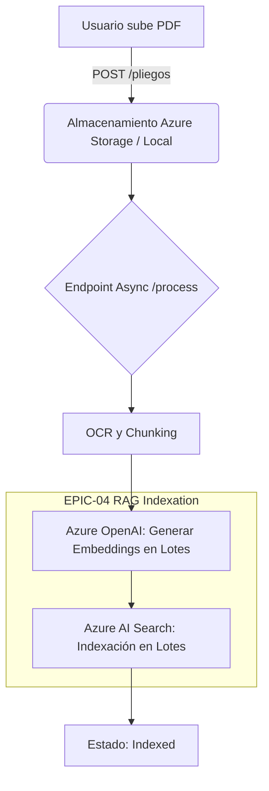

# Diseño del Módulo RAG (Retrieval-Augmented Generation)

Este documento justifica las decisiones técnicas y de arquitectura detrás de la indexación y recuperación vectorial (RAG) implementada en LicitAI.

## 1. Estrategia de Fragmentación (Chunking)

Hemos optado por un **tamaño de chunk de ~800 caracteres** con un **solape (overlap) de 150 caracteres**, aplicando una división inteligente por palabras (no corta palabras a la mitad).

**Justificación:**
- **Semántica:** 800 caracteres equivalen a un par de párrafos, que es la longitud ideal para mantener un contexto coherente sin introducir ruido. Chunks muy grandes diluyen la relevancia del texto; chunks muy pequeños carecen de contexto para responder preguntas complejas.
- **Solape (150 char):** Garantiza que si una idea o entidad se menciona entre el final de un párrafo y el principio de otro, no se pierda el contexto semántico entre dos chunks separados.

## 2. Generación de Embeddings

Utilizamos el modelo **`text-embedding-3-small` de Azure OpenAI**.

**Justificación:**
- **Coste y Rendimiento:** La generación de dimensiones más reducidas (1536) es mucho más barata y rápida que modelos `large`, manteniendo casi el mismo nivel de accuracy en benchmarks MTEB.
- **Batching:** La integración (véase `app/services/embeddings.py`) envía lotes de 100 chunks a la API de Azure OpenAI, minimizando la latencia de red y el overhead de HTTP en la orquestación, optimizando también la gestión del *Rate Limiting*.

## 3. Azure AI Search: Arquitectura e Índice Vectorial

Hemos elegido **Azure AI Search** sobre alternativas open-source puras (como ChromaDB o Milvus) o servicios como Pinecone.

### 3.1. HNSW vs Exhaustive KNN
Para el vector de embeddings, configuramos el perfil `licitai-vector-profile` utilizando el algoritmo **HNSW (Hierarchical Navigable Small World)** con la métrica de distancia coseno.

**Justificación:**
- HNSW es un algoritmo ANN (Approximate Nearest Neighbor) que construye grafos multicapa. Ofrece tiempos de respuesta de milisegundos en índices de cientos de miles de vectores, en contraposición al KNN exacto que es computacionalmente prohibitivo ($O(n)$) en producción. La pérdida marginal de recall se compensa sobradamente con la velocidad.

### 3.2. Búsqueda Híbrida y Semantic Ranker
Nuestro esquema (`app/services/indexing.py`) configura `SearchableField` para búsqueda por texto completo (BM25) y una `Collection(Edm.Single)` para vectores. Además, usamos **SemanticSearch**.

**Justificación:**
- **Hybrid Search:** Combina la precisión por palabras clave de BM25 (ideal para encontrar números de expediente o artículos legales exactos) con la flexibilidad semántica de los vectores.
- **Semantic Ranker:** Tras hacer el *retrieval* híbrido, Azure AI Search re-ordena los resultados (re-ranking) basándose en modelos de comprensión lectora de Microsoft (L2 Ranker), lo que mejora drásticamente el NDCG (Normalized Discounted Cumulative Gain) en RAGs documentales legales.

## 4. Diagrama de Flujo del Pipeline Ingesta-RAG

